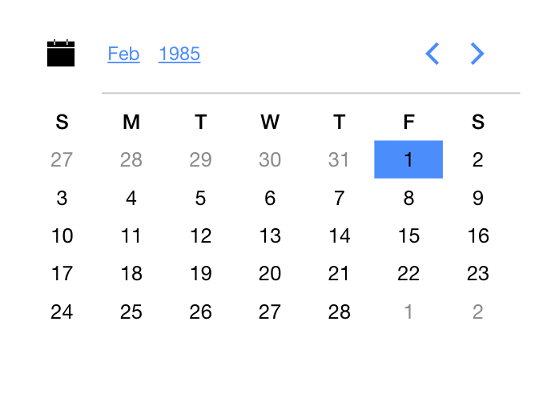
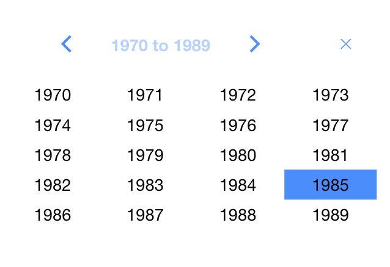
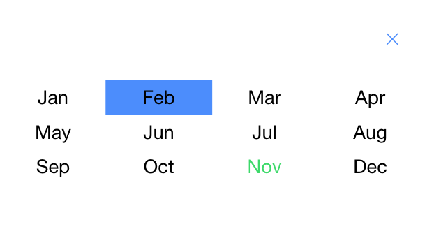
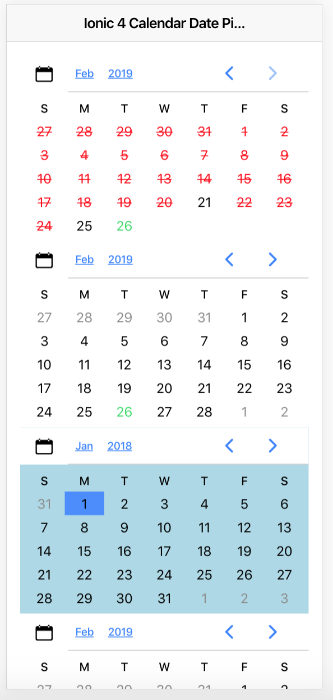

# Ionic Date Picker Component

This is a date picker component for your Ionic 4 app.


## How to use ###

### 1) Install using npm ###

```
    npm i ionic4-date-picker --save
```

### 2) Add it to your ngModule in <yourPage>.module ###

```
import { DatePickerModule } from 'ionic4-date-picker';
```
```
   
@NgModule({
 ...,
  imports: [
    ....
    DatePickerModule
    ....
  ],
  ....
})
```
### 3) Use the directive ionic-calendar-date-picker in your html  ###
```
    <ionic-calendar-date-picker (onSelect)="dateSelected($event)"></ionic-calendar-date-picker>	
```


## Options ###

 `(onSelect)` - An event that is created when a date is selected. Outputs Date object.
 
 `[date]` - A date object that sets the selected date in the calendar. (not required. Default is today)

  `[fromDate]` - A date object that sets the min date in the calendar. (not required)

 `[toDate]` - A date object that sets max date in the calendar. (not required)
 
 `[monthLabels]` - An array of month label strings. (not required. Default is ['Jan', 'Feb', 'Mar', 'Apr', 'May', 'Jun', 'Jul', 'Aug', 'Sep', 'Oct', 'Nov', 'Dec'];)
 
 `[dayLabels]` - An array of day label strings. (not required. Default is ['S', 'M', 'T', 'W', 'T', 'F', 'S'];)

 `[validDates]` - An array of Date objects. When this is provided all the other dates will be disabled. The component still respects start date and end date if provided (not required. Default is [];)

 ## Styling Option by Date ###
 `[dateStyles]` - An Java dictionary representing style (value) for each date in YYYY-MM-DD (key in ISO).
                  For eg:
                    dateStyles = { 
                                  '2019-04-10': {'background-color': 'red'},
                                  '2019-04-09': {'background-color': 'green'},
                                  '2019-04-08': {'background-color': 'blue'},
                                };
                    Hint: You can use toDate().toISOString().slice(0,10) on your Date object to quickly get the key.


## Styling Options ###
  ```
    <ionic-calendar-date-picker [notInCalendarStyle]="{'color': 'red', 'font-weight': 'bold'}"></ionic-calendar-date-picker>
  ```
  
  None of these are required options.

  
  `[backgroundStyle]` - Background color of the component. Default: { 'background-color': '#ffffff' };

  `[notInCalendarStyle]` - When a day is not in the calendar. Default: { 'color': '#8b8b8b' };
  
  `[dayLabelsStyle]` - Day Label styling (S, M, T, W ... ). Default: { 'font-weight': 500, 'font-size': '14px' };
  
  `[monthLabelsStyle]` - Month Label Styling (Jan, Feb, Mar ... ). Default: {  'font-size': '15px' };
  
  `[yearLabelsStyle]` - Year Label Styling (2000, 2001 ...). Default: {  'font-size': '15px' };
  
  `[itemSelectedStyle]` - Styling on selected Item by the user. Default: { 'background': '#488aff', 'color': '#f4f4f4 !important' };
  
  `[todaysItemStyle]` - Styling on showing todays Day, Month, Year. Default: { 'color': '#32db64' };

  `[invalidDateStyle]` - Styling on invalid Dates when you provide validDates input. Default: { 'text-decoration': 'line-through', 'color': 'red' };

### 4) Pictures ###








